# 项目介绍

## 设计报告

KevSharp通过**论坛+课程**相结合的模式激发人们的学习积极性，为每位用户设置**个人资料库**方便用户的学习管理，并**允许用户自制教学视频**存放在个人资料库，如果**视频受到人们的广泛好评并通过平台审核**，此视频将正式发布在教育平台中。除大论坛外，每一个课程视频还带有一个**讨论区**，供学生讨论。通过允许用户自制教学视频，平台的教育资源会不断进行**自我迭代更新**，最终形成一个良好的生态环境。  
在这个项目中，我们完成了以下任务：

#### 数据库服务器与文件服务器的搭建和维护

我们需要维护一个数据库，数据库中有下述表：User table, video table, file table, Post table, Block table；User table以存储每个用户的个人信息（账号、密码等)，所发帖子以及回复，所上传视频和文件的ID等；video/file table存储了网站上的视频/文件；Post table维护了整个论坛信息。  
数据库概览如下图：  

#### Web服务器的搭建

我们需要搭建一个Web 服务器处理客户端的请求，根据客户端的请求向客户端提供html文件和修改数据库以及文件系统。此外我们需要将网站操作与数据库的动态更新连接起来，比如用户注册账号之后，User table中的表项会增加。

Web 服务器运行一个Server，对每一个request， server提供一个端口处理该请求。

#### 前端设计

我们需要设计出可视化的网站，把这些网站以jsp文件或者html文件的形式存在Web服务器中。用户通过浏览器向web 服务器请求网站文件，在客户端显示可视化网站

## 代码及程序介绍

### 一、用户状态管理：

#### 1)注册

register.jsp中填写姓名，密码，游戏，生日的信息，然后通过表单传到add_register.jsp，add_register.jsp通过insert语句将注册信息插入到数据库中，这里由于我们数据库对于user_id的设置是自增的，插入时不需要指定，插入后返回user_id告知用户。

#### 2)登陆

welcome.jsp中输入id和密码，然后通过表单传到login.jsp中，通过select语句在数据库中找出user_id对应的密码对比其是否一致。同时若登陆成功，在session中维护user_id的信息。（后续工作，对密码进行md5加密）

#### 3)登出

在logout.jsp当中实现用户状态的登出（在页面的顶栏用户选项中有“我要登出”的入口），通过将session中user_id属性remove来实现登出，提示登出并会跳转到未登录状态下的主页。

### 二、主页、各区页面及搜索页

#### 顶栏

顶栏的内容是站点中每个页面都一样的，左侧为logo，右侧为各个区链接，以及用户状态栏。当用户未登录时，显示按钮“注册/登录”并链接到welcome.jsp；用户已经登录时，显示两个下拉菜单：用户按钮和发布按钮，用户下拉为用户页面(链接到user.jsp)和“我要登出”(链接到logout.jsp)，发布按钮下拉为发布视频(链接到upload_video.jsp)、发布资料(链接到upload_file.jsp)以及发表帖子(链接到add_post.jsp)。

#### 搜索

在主页以及各区页面中设有搜索框，输入关键字点击搜索按钮则会跳转到search.jsp。search.jsp通过java语句进行sql查询，在videos, files, posts中均查找title中包含关键词的记录，并将这些记录显示出来。

#### 主页

主页index.jsp展示了一些宣传语以及“今日推荐”，选取各个区的热度最高的6个内容链接展示。

#### 各区页面

视频区shipinqv.jsp、资料区ziliaoqv.jsp、论坛区luntanqv.jsp，这三个页面分别负责展示所有的视频、资料和帖子。jsp会分版块(block)按照热度递减列出该版块下的所有内容标题以及链接。‘

### 三、论坛部分：

论坛部分代码的主要实现利用JSP和SQL，依靠后端运行编译后的java程序从数据库中获取相关帖子的信息，然后加上标签发送给客户端，相关功能以及代码：

#### 1）发帖

add_post.jsp填写帖子的内容(content)和标题(title)，然后将其和板块号(block_id)作为表单发送给 add_post_to_sql.jsp。add_post_to_sql.jsp完成向数据库中插入代码的功能，将获得的block_id和title，content，time用insert语句插入到数据库中

#### 2)发回复

add_reply.jsp填写帖子的内容(content)，然后将其和帖子号(post_id)作为表单发送给 add_reply_to_sql.jsp。add_reply_to_sql.jsp完成向数据库中插入代码的功能，将获得的post_id和content，time用insert语句插入到数据库中

####  3)删除帖子

delete_post.jsp，得到通过表单传入的post_id，然后用delete语句从数据库中删除该post_id的帖子。由于回复又对post_id的外码约束，所以必须先删除指向该帖子的全部回复，即用delete删除指向该post_id的回复。

#### 4)删除回复

delete_reply.jsp，得到通过表单传入的reply_id，然后用delete语句从数据库中删除该reply_id的帖子。

#### 5)对单个帖子的操作

post.jsp实现了每个帖子及其回复的显示，通过传入的post_id，用selcet语句从数据库中得到帖子和回复的相关内容，将其显示在页面上。同时加入一个回复帖子的跳转按钮链接到add_reply.jsp，对于每一条评论加入删除按钮，链接到delete_post.jsp.

### 四、视频部分：

视频播放页面为video.jsp，通过传递的video_id来从sql数据库中找到相应的记录，如up主信息、title、视频路径等等。然后利用`<video>`标签采用HTML5播放器进行播放。同时，我们还利用javascript函数实现了小窗播放，即当页面下拉到视频不在显示范围内时，在页面右下角显示一个小窗区域来继续播放视频。

### 五、资料部分：

资料页面为show_material.jsp，通过传递的file_id来在sql数据库中找到相应的记录，包括title、路径等。然后我们会根据文件的路径判断是否是pdf文件，若是则在页面中直接显示，否则只提供下载链接。我们在页面中采用`<iframe>`标签来显示pdf。

### 六、数据传输：

#### 1)上传

upload_video.jsp和upload_file.jsp实现视频和资料的上传，由于大文件要用字节流传输，所以设置`enctype="multipart/form-data"`，但是同时传送的表单为字符，所以在接受部分要特别处理。

#### 2)接受

catch_file.jsp和catch_video.jsp进行文件接受，此处利用jsmartcom_zh_CN.jar包，从传输的字节流中获取文件描述content等信息，同时通过文件IO将其写入本地，把content和路径写入数据库中，维持一致性。

### 七、前端设计

前端设计用各种标签来对网站样式进行美化，采用css模板进行渲染，见`/css`目录下的文件。我们的图标(不包含网站logo)来源于[Font Awesome](https://github.com/FortAwesome/Font-Awesome)，一套图标字体库和css框架，包括各区logo、用户logo等矢量图标均来自于此。

## 测试报告

### 协议分析及测试

Kevsharp分为网站服务器，文件服务器，数据库三部分

由于没有公网IP，我们直接使用本地IP访问网站，无法进行域名解析。客户端访问网站时，客户端和主机服务器通过TCP/IP三次握手建立连接，然后向客户端请求jsp文件。如果客户端在本地更新页面或者进入新的页面(比如登陆，播放视频页面)，则客户端通过HTTP协议向服务器发送请求报文，请求新的jsp文件，服务器给出响应。

当用户在本地进行注册账号或者查询视频等需要访问数据库的操作时，用户首先通过目前与网页服务器已经建立好的TCP连接发送请求报文，之后网页服务器通过tomcat与数据库服务器或者文件进行连接。

在网站服务器与数据库服务器连接过程中，其协议仍然使用TCP/IP协议。数据服务器开启后在本地设置一个监听窗口，当检测到客户端(这里是网站服务器)发来的网络请求时，通过三次握手建立连接。

当浏览器(客户端)完成请求后，需要通过四次挥手断开连接。首先客户端会发送一个带有FIN标识和一个seq随机数，服务端收到之后，会回应一个ack，ack的值等于刚才的seq的值+1，发送之后，服务器会再发一个包，这个包里面也带有FIN标识和一个seq随机数，客户端收到之后，回应一个ack，ack的值等于刚才的seq值+1，以上完成之后，服务器和客户端的4次挥手就完成了！

## 使用说明

### 网站搭建

我们采用Eclipse+JAVA环境，在Eclipse中配置了Tomcat后端服务器，来进行JSP(JavaServerPage)的后端处理。同时需要配备MySql数据库服务器，用`create.sql`创建数据库以及插入数据。在`settings.properties`中设置MySql服务器的地址及端口，以及项目在服务器上的绝对路径。一切配置完成后，开启Tomcat服务器进行后端处理，开放网站的端口。

### 用户使用说明

在开启Tomcat服务器后，用户便可以在同一个局域网下（因为目前没有公网IP）使用浏览器访问“http://localhost:8080/WebContent/”(实际使用时localhost换成服务器主机的IP地址，由于没有公网IP，这里也没有注册为一个域名方便访问)，便可以进入我们的主页面，页面下半部分为视频区、资料区、论坛区各自前六名热度的内容，主页面的后端代码为“index.jsp”，效果如下：  
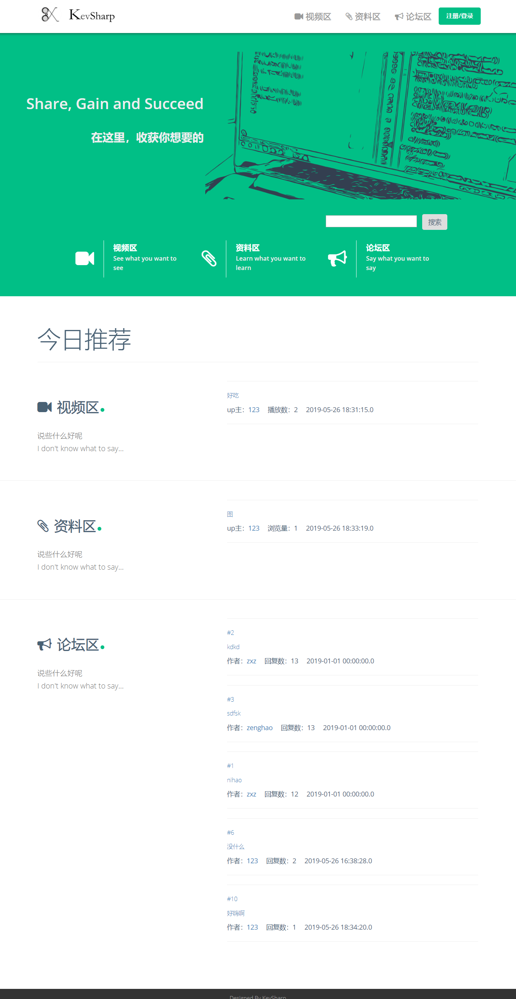

之后可以点击右上角的“注册/登陆”按钮进入后端代码为“welcome.jsp”的登陆页面进行注册或登陆，效果如下：  

登陆成功则跳转至主页面，没有账号的用户可以点击注册按钮进行账户注册，转到后端代码为“register.jsp”的注册页面，效果如下：  

之后“add_register.jsp”中会检查用户是否全部填写了注册信息，以及每项信息的格式是否正确，如果正确则会提示注册成功，点击“确定”便跳转到登陆界面，效果如下：  

登陆之后通过右上角的加号可以上传视频、文件、发帖，效果如下：  

1.点击“发送视频”即可进入上传视频页面，后端代码为“upload_video.jsp”，效果如下:  
   
点击上传即可将视频通过代码“catch_file,jsp”上传到服务器，若上传成功则跳转至主页面，若视频已存在则告知视频已存在，上传失败。

2.点击“分享资料”即可进入上传文件页面，后端代码为“upload_file.jsp”，效果如下：  
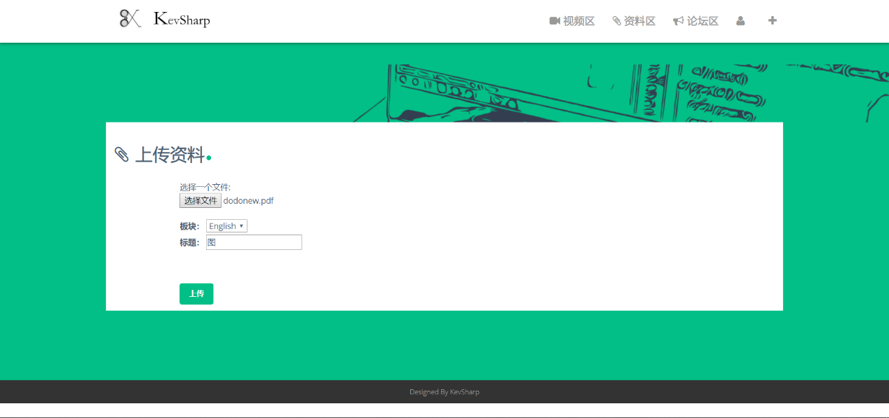 
点击上传即可将文件通过代码“catch_file,jsp”上传到服务器，若上传成功则跳转至主页面，若文件已存在则告知文件已存在，上传失败。

3.点击“发表帖子”即可进入发帖页面，后端代码为“add_post.jsp”效果如下：  
   
点击“发送帖子”即可将帖子发出，之后进入帖子所在页面。

对于每个页面都有的顶栏，点击视频区可以进入视频区页面，后端代码为“shipinqv.jsp”，页面分为数学、计算机、英语三个版面，每个版面里有各版面的视频，效果如下：  
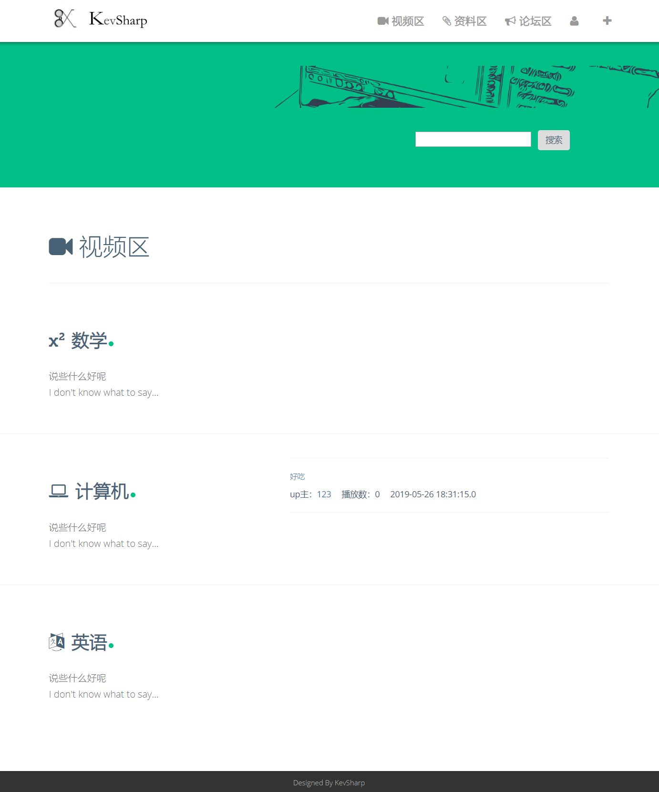 

点击资料区可以进入资料区页面，后端代码为“ziliaoqv.jsp”，页面分为数学、计算机、英语三个版面，每个版面里有各版面的文件，效果如下：  
 

点击论坛区可以进入论坛区页面，后端代码为“luntanqv.jsp”，页面分为数学、计算机、英语三个版面，每个版面里有各版面的帖子，效果如下：  
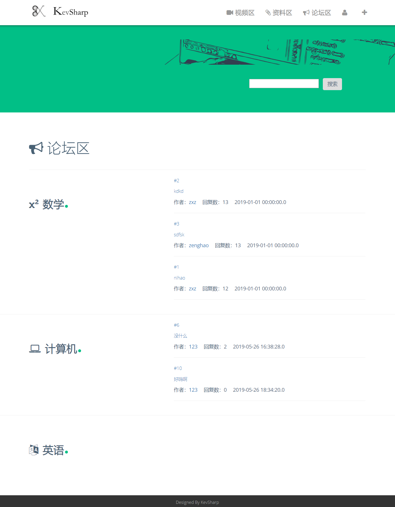   
点击右上角的小人或者任意页面上的上传者信息可以进入用户页面，显示用户信息，后端代码为“user.jsp”，访问自己的页面会显示“我的...”，访问其他用户页面会显示“TA的...”，效果如下：
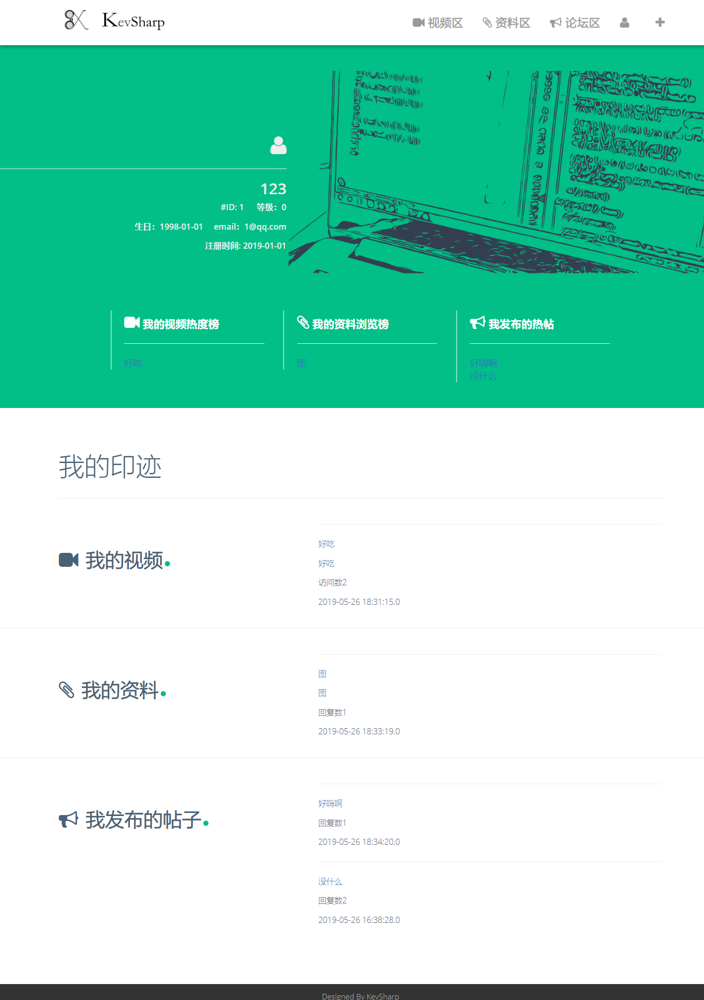 
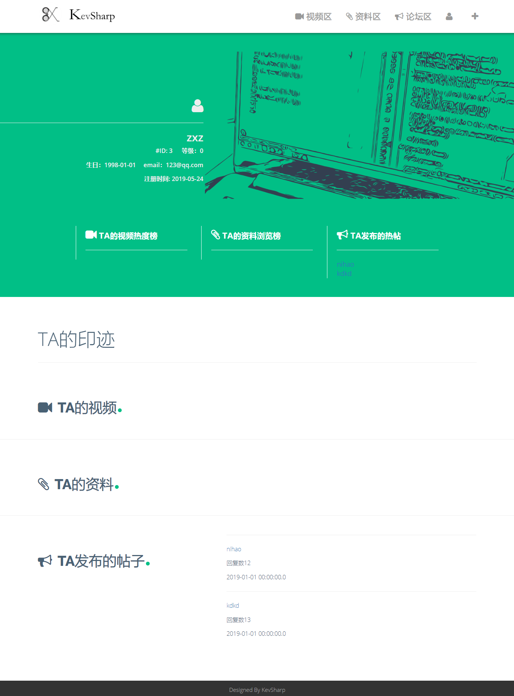 

对于主页与各个分区以及用户界面上的视频，点击后便可以进入播放页面，会使播放量自增，后端代码为“video.jsp”，用户可以使用调节声音、全屏、小窗、下载等功能，效果如下：
 
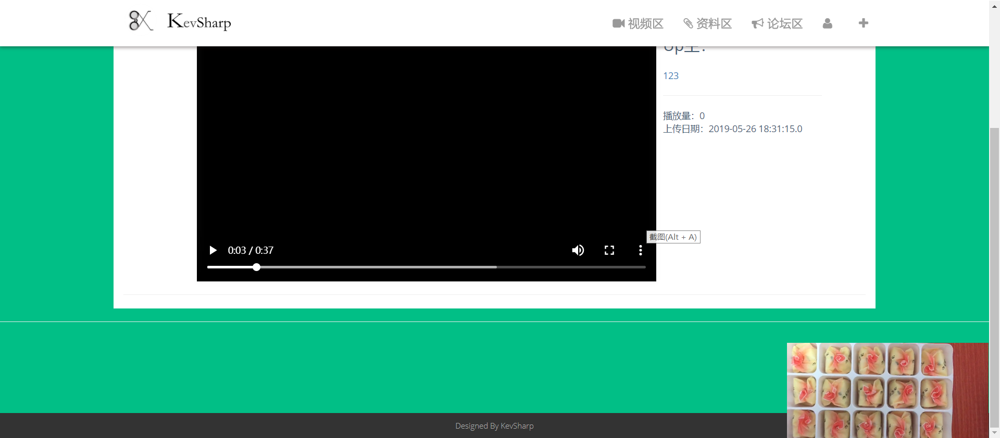 

对于主页与各个分区以及用户界面上的文件，点击后便可进入预览页面，会使访问量自增，后端代码为“show_material.jsp”，用户可以使用全屏浏览、下载等功能，效果如下：
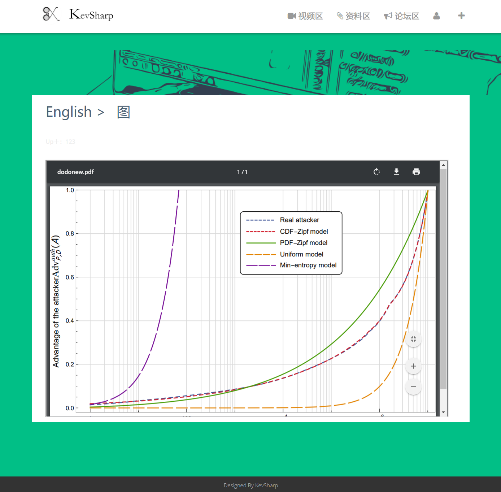 

对于主页与各个分区以及用户界面上的帖子，点击后便可进入帖子页面，可以回复帖子，回复会使帖子回复量自增，帖子页面的后端代码为“post.jsp”，如果是自己发的帖子，可以选择删除，跳转到“delete_post.jsp”将帖子与其下的评论都从数据库中删除；同样如果是自己的回复，也可以删除，跳转到“delete_reply.jsp”将评论删除，效果如下(本用户为123)：
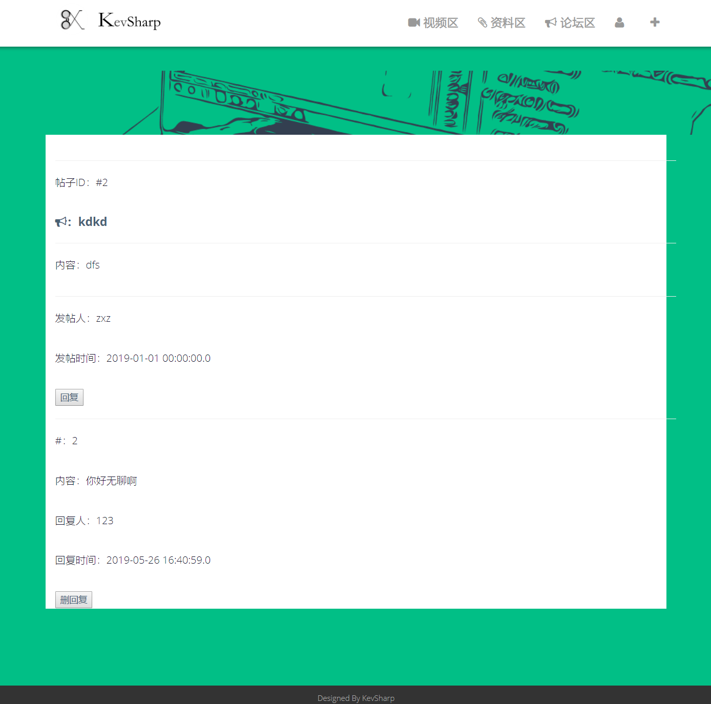 
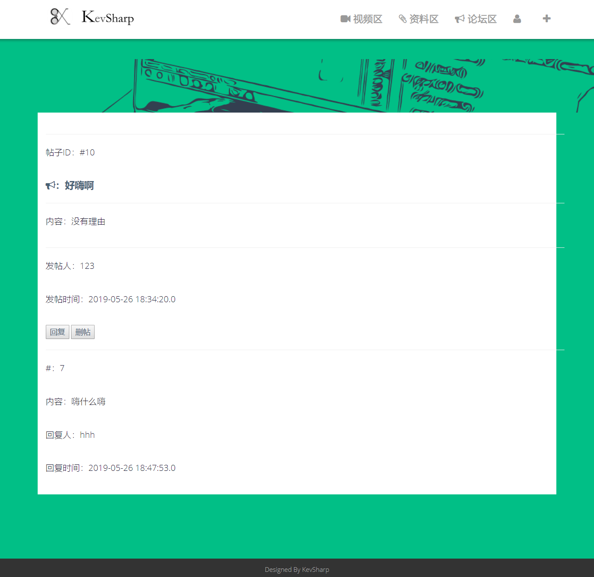 

用户可以在有搜索框的页面对所需内容进行搜索，跳到“search.jsp”对用户的输入在数据库中相似匹配，效果如下：
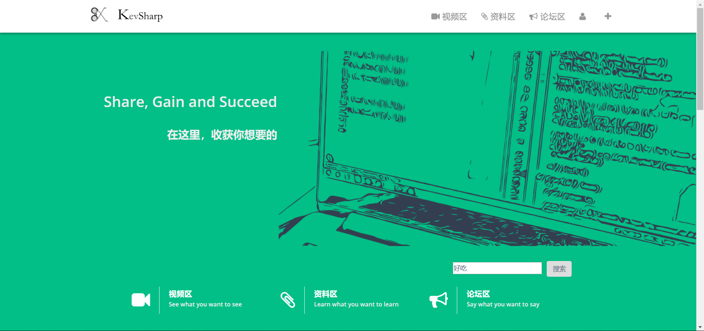 
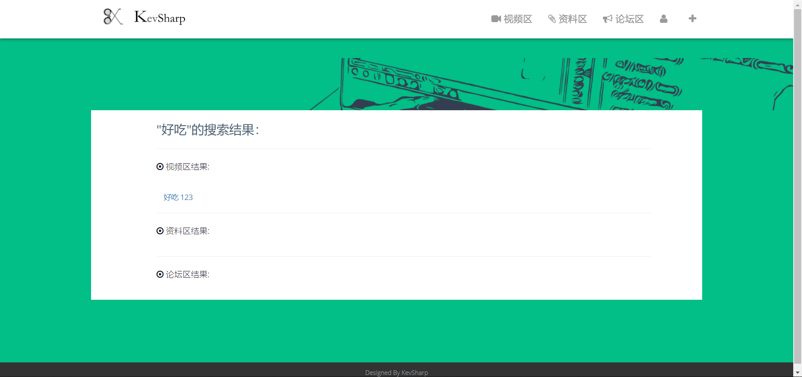 

用户可以点击右上方小人选择退出，跳到“logout.jsp”终止会话，发送已登出的信息后点击“确认”跳转到主页面，效果如下：

 
